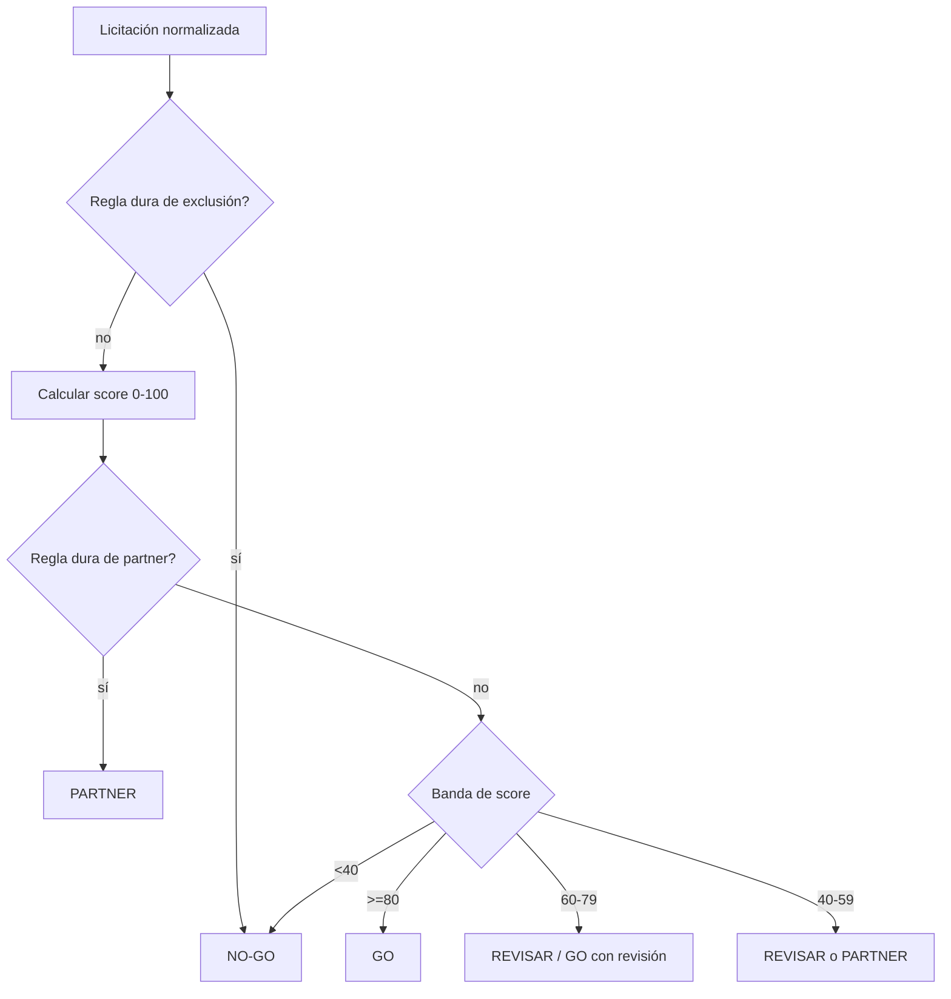

# Metodología Go / No-Go

La recomendación final combina el **score** ([scoring-model.md](scoring-model.md)) con un conjunto
de **reglas duras** y el criterio del análisis IA. Produce una de cuatro etiquetas:

| Etiqueta | Acción esperada |
|----------|-----------------|
| **GO** | Preparar oferta; oportunidad prioritaria |
| **REVISAR** | Requiere validación humana (solvencia, plazo, alcance) antes de decidir |
| **PARTNER** | Viable solo en UTE/subcontrata; buscar socio |
| **NO-GO** | Descartar |

## Orden de evaluación

## Reglas duras (overrides)

Las reglas duras tienen prioridad sobre el score:

**Exclusión → NO-GO**
- CPV en lista de excluidos del perfil Keedio.
- Objeto claramente fuera de catálogo (obra civil, suministro puro no tecnológico, etc.).
- Solvencia exigida imposible de cumplir ni con partner.

**Partner → PARTNER**
- Solvencia técnica exigida que Keedio no alcanza sola pero sí con socio habitual.
- Lotes/volumen que superan capacidad de entrega en solitario.

**Revisión urgente → REVISAR (flag urgente)**
- Plazo de presentación por debajo del mínimo operativo (configurable, p. ej. < 7 días).
- Importe muy alto con criterios de adjudicación ambiguos.

## Papel de la IA

Para licitaciones que superan el cribado, el `tender-ai-analysis-service` aporta:

- **Resumen ejecutivo** del objeto y alcance.
- **Requisitos** y **criterios de adjudicación** (precio vs técnicos).
- **Solvencia** técnica y económica exigida (para contrastar con el perfil).
- **Riesgos** e **incompatibilidades**.
- Una **recomendación preliminar** con su justificación.

El análisis IA **no sustituye** al score ni a las reglas: las alimenta y las explica. La decisión
final la toma una persona desde Telegram o el dashboard; esa decisión se registra como
`tender.user_action_received`.

## Trazabilidad

Para cada licitación se guarda: score con desglose, etiqueta recomendada, reglas duras activadas,
resumen IA, y el historial de acciones humanas. Así toda decisión es auditable.
