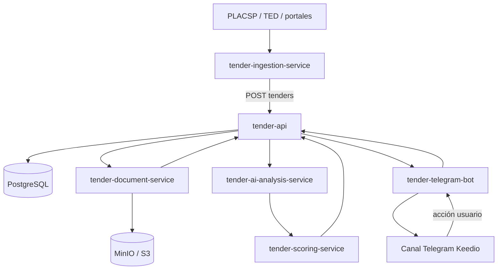
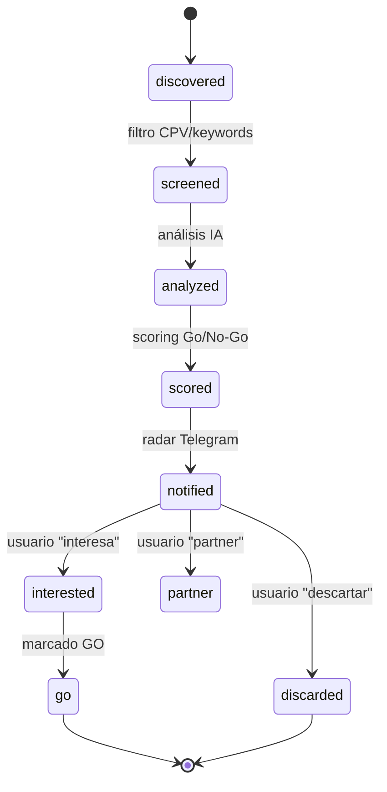

# Arquitectura técnica

Keedio Tender Radar es una plataforma **multi-repo** de servicios desacoplados que se comunican
por HTTP a través de `tender-api` y por **eventos de dominio** (definidos en
`tender-shared-contracts`). El estado vive en PostgreSQL; los documentos en almacenamiento de
objetos (MinIO/S3); los embeddings para RAG en pgvector (o Qdrant en fases avanzadas).

## Vista de servicios (MVP)



> En el MVP-1, scoring puede vivir embebido junto al análisis; se separa en
> `tender-scoring-service` cuando las reglas crezcan. `tender-document-service` entra en MVP-2.

## Servicios y responsabilidad única

| Servicio | Responsabilidad | Fase |
|----------|-----------------|------|
| `tender-ingestion-service` | Leer fuentes, normalizar, deduplicar, publicar al API | 1 |
| `tender-api` | Núcleo: modelo de datos, API REST, orquestación, auth | 1 |
| `tender-ai-analysis-service` | Resumen, requisitos, solvencia, criterios, riesgos | 1 |
| `tender-scoring-service` | Modelo Go/No-Go y recomendación explicada | 1 (embebido) → 2 |
| `tender-telegram-bot` | Radar diario, alertas, acciones inline | 1 |
| `tender-document-service` | Descarga/extracción/chunking de pliegos | 2 |
| `tender-web-dashboard` | Frontend interno | 3 |
| `tender-market-intelligence-service` | Competidores, bajas, organismos, CPV | 5 |
| `tender-offer-generator` | Go/No-Go report, matriz cumplimiento, borradores | 6 |
| `tender-infra` | Docker Compose / K8s / Helm / Terraform | 1 |
| `tender-observability` | Métricas, logs, alertas, coste IA | 4 |

## Stack

- **Servicios:** Python 3.12, FastAPI, Pydantic v2, httpx, APScheduler/cron para jobs.
- **API:** FastAPI + PostgreSQL + SQLAlchemy + Alembic (+ Redis para colas/caché ligera).
- **IA:** OpenAI / Azure OpenAI / modelo local (interfaz intercambiable); RAG con pgvector.
- **Almacenamiento de documentos:** MinIO (local) / S3 (cloud).
- **Frontend:** Next.js + TypeScript + Tailwind + shadcn/ui.
- **Infra:** Docker Compose (MVP) → Kubernetes + Helm; Terraform si cloud.

## Comunicación: HTTP + eventos

Los servicios no se llaman directamente entre sí salvo a través del `tender-api`. El flujo se
modela con **eventos de dominio** (ver `tender-shared-contracts/python/tender_contracts/events.py`):

```
tender.discovered          → la ingesta encontró una licitación nueva
tender.updated             → cambió una licitación existente
tender.documents_found     → se detectaron pliegos descargables
tender.documents_downloaded
tender.documents_extracted
tender.analysis_completed  → la IA terminó el análisis
tender.scored              → se calculó el score Go/No-Go
tender.telegram_notification_sent
tender.user_action_received → el usuario actuó (interesa/descartar/partner/…)
```

En el MVP el "bus" puede ser tan simple como tablas + polling o Redis Streams; la abstracción es
lo que importa para no acoplar servicios.

## Modelo de datos (núcleo, en `tender-api`)

```
tenders                  (licitación normalizada + estado)
tender_documents         (pliegos: metadatos + ubicación en objeto)
tender_chunks            (fragmentos + embeddings para RAG)
tender_ai_analysis       (resumen, requisitos, solvencia, criterios, riesgos)
tender_scores            (scores por dimensión + total + recomendación)
tender_notifications     (envíos a Telegram)
tender_actions           (decisiones humanas)
company_profile          (perfil Keedio para scoring)
competitors / contracting_bodies / award_history  (inteligencia de mercado, fase 5)
```

## Estados de una licitación



Ver ADRs en [`adr/`](adr/) para las decisiones de arquitectura y su justificación.
